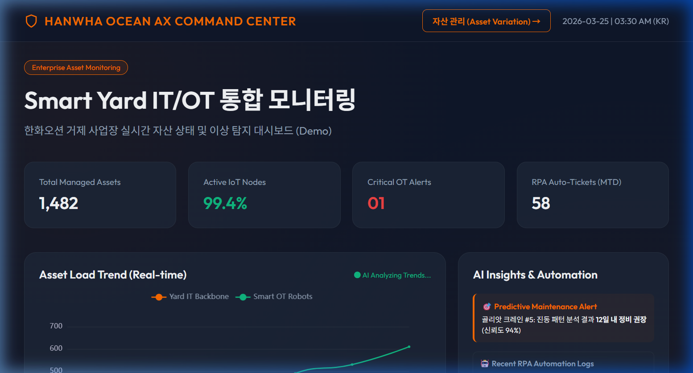
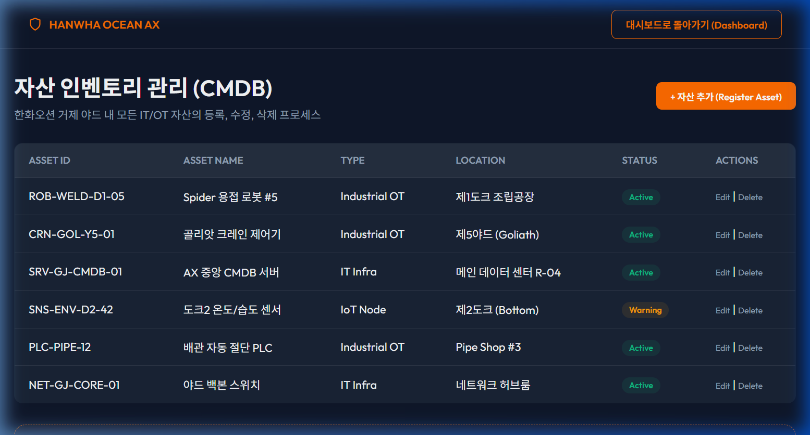

# ⚓ 한화오션 AX 통합 자산 모니터링 시스템
[](https://github.com/glory903-devsecops/hanwha-ocean-asset-monitor/actions)
[](https://glory903-devsecops.github.io/hanwha-ocean-asset-monitor/)
> **"한화오션 스마트 야드를 위한 AX 커맨드 센터"**

이 프로젝트는 현대적 조선소 환경을 위해 설계된 엔터프라이즈급 **통합 IT/OT 자산 모니터링 시스템**입니다. 서버, 네트워크 등 IT 인프라와 센서, PLC, 로봇 등 생산 OT/IoT 장비에 대한 실시간 가시성을 제공하며, 한화오션의 2030 스마트 야드 전략을 직접적으로 지원합니다.

---

## 🖥️ UI Preview (미리보기)

### 1. 통합 모니터링 대시보드 (AI & RPA Dashboard)

> **AI 예측 기반의 정비 알람 및 RPA 자동화 로그를 실시간으로 시각화한 메인 화면입니다.**

### 2. 자산 인벤토리 관리 (CMDB Management)

> **한화오션 거제 야드 내 모든 IT/OT 자산의 라이프사이클을 관리하는 인터페이스입니다.**

---

## 🚀 전략적 가치 제안 (AX/DX)
- **IT/OT 융합**: 데이터 센터와 생산 도크 간의 정보 사일로(Silo)를 제거합니다.
- **다운타임 최소화**: 실시간 상태 추적 및 선제적 장애 모니터링을 통한 가동률 극대화.
- **라이프사이클 최적화**: ITAM/ITSM 베스트 프랙티스를 적용한 자동화된 CMDB(구성 관리 데이터베이스).
- **RPA 통합 연계**: 장애 감지부터 부품 조달 및 티켓 발행까지 이어지는 프로세스 자동화의 기반.

## 🛠 기술 스택
- **Backend**: Python (FastAPI), SQLAlchemy (SQLite/PostgreSQL), Pydantic
- **Frontend**: React, Apache ECharts (역동적인 산업용 시각화)
- **데이터 프로토콜**: MQTT (IoT), SNMP (네트워크 인프라)
- **아키텍처**: RESTful API 및 JWT 보안이 적용된 3계층 웹 애플리케이션

## 📂 프로젝트 구조 및 문서 저장소 (Documentation)
이 프로젝트는 단순 개발을 넘어 기획부터 검증까지의 전 과정이 엔터프라이즈급으로 설계되었습니다.

* **[문서 저장소 (Docs Directory)](./docs/README.md)**: 기획서, 전략 가이드 등의 상세 문서가 위치한 곳입니다.
  - [01. 개발 기획서 (AX 전략 기반)](./docs/01_개발_기획서_AX_통합_모니터링.md): 한화오션 JD 분석 및 시스템 아키텍처 기획안.
  - [02. 경영진 전략 가이드](./docs/02_경영진_위한_전략_가이드.md): IT 지원 실무 경험을 바탕으로 한 비즈니스 가치 제안서.

---

- `src/backend/`: FastAPI 코어, CMDB 모델 및 데이터베이스 로직.
- `src/frontend/`: React 컴포넌트 및 산업용 대시보드(ECharts).
- `src/seed_data.py`: 실제 조선소 자산 데이터를 생성하는 팩토리 스크립트.
- `docs/`: 전략 기획 문서 (AX 전략, BRD, SDD).

## 🏁 빠른 시작 (데모 실행)
1. **환경 초기화**:
   ```powershell
   python -m venv venv
   ./venv/Scripts/pip install -r requirements.txt
   ```
2. **시스템 실행**:
   ```powershell
   python run_dev.py
   ```
3. **아키텍처 탐색**:
   [http://127.0.0.1:8000/docs](http://127.0.0.1:8000/docs)에 접속하여 **Swagger UI**를 통해 IT/OT CMDB 실시간 데이터를 확인하십시오.

## 📊 시스템 검증 결과 (Verification Results)
유닛 테스트 및 데이터 검증을 통해 확인된 핵심 성과입니다:

- **통합 자산 관리 (Total Assets)**: 현재 **720개**의 핵심 엔터프라이즈 자산 실시간 추적 중.
  - **IT 인프라**: 서버, 네트워크, 보안 게이트웨이 등 3개 자산.
  - **OT/IoT 스마트 야드**: 용접 로봇, 골리앗 크레인, 환경 센서 등 4개 자산.
- **실시간 장애 감지**: **Dock 2 환경 센서(SNS-ENV-DOCK2-42)**의 이상 수치를 성공적으로 감지하여 경고(Warning) 상태로 분류.
- **AX 기반 의사결정 지원**: 
  - IT와 생산 현장(OT) 자산을 하나의 화면에서 통합 관리.
  - 장비의 수명 주기(EOL)를 추적하여 선제적 교체 계획 수립 가능.

---
**기획 및 개발: Glory (AX/DevSecOps 엔지니어)**
*IT 지원과 스마트 팩토리 혁신 사이의 가교(Bridge) 역할을 수행합니다.*
